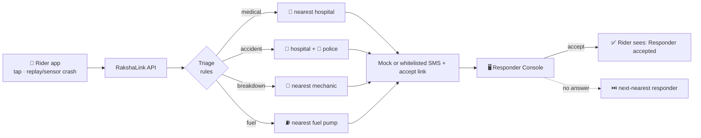
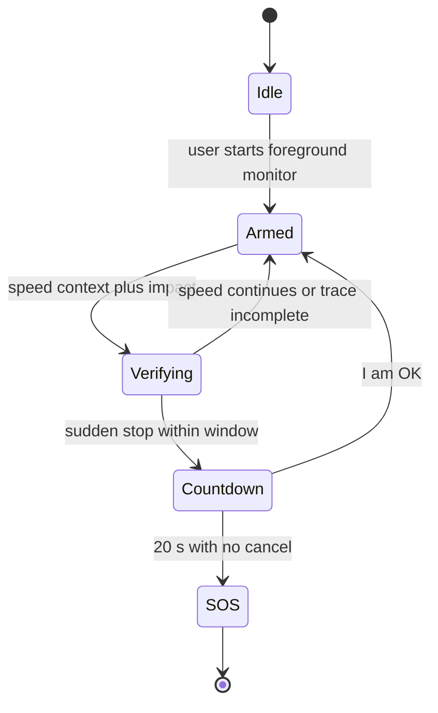

<p align="center">
  
</p>

<h3 align="center">Not just an SOS button.<br>A triage agent that knows exactly who to call, online or off.</h3>

<p align="center">
  
  
  
</p>
<p align="center">
  
  
  
  
</p>

<p align="center">
  <a href="#why-rakshalink-exists">Why</a> &nbsp;·&nbsp;
  <a href="#what-it-does">Features</a> &nbsp;·&nbsp;
  <a href="#how-it-works">How it works</a> &nbsp;·&nbsp;
  <a href="#design">Design</a> &nbsp;·&nbsp;
  <a href="#build-status">Status</a> &nbsp;·&nbsp;
  <a href="#safety-and-honesty">Safety</a> &nbsp;·&nbsp;
  <a href="#team-inittowinit">Team</a>
</p>

<p align="center"></p>

<table align="center">
  <tr>
    <td align="center" width="33%"><b>Four SOS paths</b><br><sub>Fuel, breakdown, accident, and medical requests use sample locations and deterministic routing.</sub></td>
    <td align="center" width="33%"><b>Responder workflow</b><br><sub>One on-duty responder is notified at a time. If they time out or decline, the next eligible match is tried.</sub></td>
    <td align="center" width="33%"><b>Offline support</b><br><sub>Queued SOS drafts persist locally and the screen flashes Morse. A team SMS draft requires a configured whitelist.</sub></td>
  </tr>
</table>

<details>
<summary><b>Judge's 60-second tour</b></summary>

1. Look at the **[Build status](#build-status)** table: every tick was earned during the 8-hour window.
2. See the **[Design](#design)** section and the architecture in [docs/ARCHITECTURE.md](docs/ARCHITECTURE.md).
3. Read what is **real versus simulated** in [docs/DEMO.md](docs/DEMO.md).
4. Read our limits and promises in [docs/SAFETY_AND_HONESTY.md](docs/SAFETY_AND_HONESTY.md).
5. The demo video and slides are linked under [Submission links](#submission-links).
</details>

<p align="center"></p>

## Why RakshaLink exists

The Ministry of Road Transport and Highways reported **1,72,890 people killed in road accidents in 2023** in its [Road Accidents in India 2023 report](https://morth.nic.in/sites/default/files/Road-Accident-in-India-2023-Publications.pdf). RakshaLink explores how a clear SOS and responder workflow might help when a road user needs assistance.

RakshaLink is built for that moment: one tap, one spoken sentence, or **no tap at all**.

## What it does

*These are our design goals. The [Build status](#build-status) table shows what is actually live.*

| | |
|---|---|
| **Four emergencies, four colours** | Fuel, Breakdown, Accident, Medical SOS. Each routes to the *right kind* of responder, not a generic dispatch. |
| **Explainable triage** | Deterministic rules map the emergency to responder types and find the nearest ones by real distance. Anything an AI model suggests is validated against the four known categories before it can act. |
| **Drive Mode crash response** | The foreground sensor prototype requires speed context, impact, and a sudden stop, then starts a **20-second alarm countdown** with a cancel button. Replayed traces are tested; real crash accuracy and physical-device behavior are unverified. |
| **Responder workflow** | The desktop console supports demo duty state, role views, Accept / Can't respond, and responder-set On the way, Arrived, and Resolved steps. The rider sees only server-reported statuses. |
| **Escalation** | Timeout or decline moves to the next on-duty match. If nobody accepts, the app says so and shows **Call 112**. |
| **Offline ladder** | SOS drafts persist locally, the screen flashes Morse, and the rider can retry when connected. A prefilled SMS draft is limited to configured whitelisted team numbers; no team number is configured in this demo. |

### How it compares with a plain SOS button

| | Plain SOS button | RakshaLink (design goal) |
|---|---|---|
| Routes by emergency type | one generic dispatch | hospital, police, mechanic or fuel pump |
| Works if the victim cannot tap | no | Drive Mode crash countdown |
| Responder side with accept and status steps | rarely | Responder Console and accept page |
| Handles "nobody answered" | silent | escalates, then tells the rider to call 112 |
| Weak or no signal | fails | SMS fallback, Morse flash, saved queue |

> RakshaLink **augments** India's 112 emergency number; it does not replace it. A Call 112 button is on every screen.

<p align="center"></p>

## How it works



```mermaid
sequenceDiagram
    participant R as Rider app
    participant S as API and triage
    participant P as Responder
    R->>S: SOS with category and location
    S->>S: pick responder types, find nearest
    S->>P: Notify one on-duty responder (mock; whitelisted SMS if configured)
    alt accepted in time
        P->>S: Accept
        S->>R: Responder accepted
    else no answer
        S->>P: Notify next on-duty match
        S->>R: If all fail, No responder answered. Call 112.
    end
```

### Drive Mode: crash response prototype



The code includes a foreground sensor prototype plus deterministic trace replay tests. It is not validated on real crashes, and no detection accuracy is claimed.

Speed context, an impact spike, and a sudden stop must all agree. Thresholds are starting values and are **not validated on real crashes**. See [docs/SAFETY_AND_HONESTY.md](docs/SAFETY_AND_HONESTY.md).

## Design

Calm under stress: big targets, plain words, one dominant action per screen, and one colour per emergency (Fuel green, Breakdown teal, Accident navy, Medical maroon).

<p align="center">
  
</p>
<p align="center">
  
</p>
<p align="center"><sub>Design references rendered from <a href="docs/DESIGN_TOKENS.md">our design tokens</a>. Screenshots of the working product are added at submission.</sub></p>

<p align="center"></p>

## Build status

*Updated live during the hackathon. A tick means it ran.*

| Tier | Feature | Status |
|---|---|---|
| T1 | One-tap SOS (4 categories) with sample/demo location | ✅ |
| T1 | Deterministic triage + nearest-responder matching | ✅ |
| T1 | Mock dispatch (team SMS not configured) | ✅ |
| T1 | Responder Console + accept page | ✅ |
| T1 | Live status with responder-set flags | ✅ |
| T1 | Drive Mode simulation: 20 s countdown, cancel, auto SOS | ✅ |
| T2 | On-duty toggle, On the way / Arrived / Resolved, role views | ✅ |
| T2 | Sequential timeout/decline escalation | ✅ |
| T2 | Offline queue + screen Morse + whitelisted SMS draft fallback | ◐ |
| T2 | Foreground sensor prototype + replayed crash traces | ◐ |
| T2 | Family alert | ◐ In-app simulation only; explicitly says no contact was notified |
| T2 | SOS-to-first-dispatch metric | ✅ |
| T3 | Voice SOS, language toggle, share, history | ⬜ |
| T3 | Responder-entered ETA estimate | ◐ In progress; optional estimate is typed by the responder and shown as such |
| T3 | Responder history | ◐ Resolved and unanswered alerts from the current demo session |
| T3 | Operations overview | ⬜ |

## Tech stack

| Layer | Choice |
|---|---|
| Mobile | Expo + React Native |
| Backend | Node.js + Express, Server-Sent Events for live updates |
| Data | In-memory haversine matching; responder demo points seeded from OpenStreetMap. PostGIS is not configured. |
| Comms | Mock dispatch by default; optional Twilio SMS to configured whitelisted team numbers. Voice is not implemented. |
| Maps | OpenStreetMap |

## Repository layout

```text
rakshalink/
├── assets/     logo, banner, social preview, divider
├── docs/       architecture, API contract, safety and honesty, design, demo, roadmap
├── server/     API, triage, dispatch, escalation
├── mobile/     rider app (Expo)
├── web/        responder console + accept page
└── .env.example
```

## Getting started

Requirements: Node.js 20 or newer, npm, and (for a physical Android demo) Expo Go on the phone. Dispatch is mock-only by default.

1. Copy `.env.example` to `.env` in the project root. Keep `DEMO_MODE=true` and `PROVIDER=mock`; leave the whitelist empty unless you have approved team test destinations.
2. In one terminal, run `cd server`, `npm install`, then `npm start`. The API and responder console are served at `http://localhost:3000`.
3. In a second terminal, run `cd mobile`, `npm install`, copy `.env.example` to `.env.local`, then start Expo with `npx expo start --lan`.
4. For a phone on the same Wi-Fi, edit `mobile/.env.local` so `EXPO_PUBLIC_API_BASE_URL` uses the computer's LAN IPv4 address, such as `http://192.168.1.20:3000`; restart Expo and open its LAN URL in Expo Go. `localhost` works for an emulator on the same computer, not a physical phone.
5. Open `http://localhost:3000` on the computer for the Responder Console. The server's in-memory demo events clear when it restarts.

The demo does not contact family, hospitals, police, or emergency services. Real calls and SMS are not part of the demo flow. For project safety details, see [Safety and honesty](docs/SAFETY_AND_HONESTY.md).

## Safety and honesty

- **Demo mode by default.** Alerts go only to team-owned test numbers. No real hospital, police station, or emergency service is ever contacted.
- **The responder network in the demo is simulated** and labelled so. Responder locations come from OpenStreetMap. Phone numbers are demo numbers.
- **The app never says help is coming unless a responder actually accepted.**
- **Dispatch can run in simulation mode**, and simulated dispatch is always labelled as such.
- Motion data stays on the phone. Only a short summary is sent when an alert fires.

Full details: [docs/SAFETY_AND_HONESTY.md](docs/SAFETY_AND_HONESTY.md).

## Roadmap

Proposals, not commitments: one pilot highway corridor, then state highways, then a national network, with responder onboarding done together with official systems such as 112. See [docs/ROADMAP.md](docs/ROADMAP.md).

## Team InitToWinIt

Guru Nanak Institute of Technology (GNIT), Kolkata.

| Name | Role |
|---|---|
| Ashish Chandra Acharjee | Team Lead |
| Pranay Saha | Team member |
| Nitin Agarwal | Team member |
| Ayush Mahato | Team member |

## Submission links

| Item | Link |
|---|---|
| Demo video | _added at submission_ |
| Slides | _added at submission_ |
| Live demo | _added at submission_ |

<p align="center"></p>

<p align="center"><sub>Map and responder data © <a href="https://www.openstreetmap.org/copyright">OpenStreetMap contributors</a>. Accident statistics: MoRTH, <i>Road Accidents in India 2023</i>. Built for the <b>Recursive</b> hackathon at GNIT. Released under the <a href="LICENSE">MIT License</a>.</sub></p>
